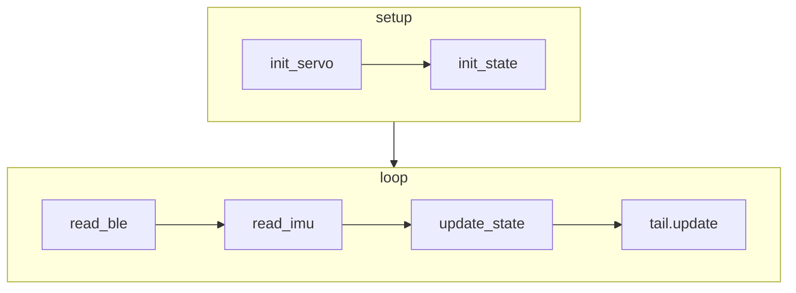

# XIAO Tail

Hacka-Tail with Seeeduino Studio XIAO BLE Sense

## Flow

state:

- stroke hard
- stroke soft
- ble command

action:

- swing tail up/down/left/right

## Notes

- mic library: https://github.com/Seeed-Studio/Seeed_Arduino_Mic
