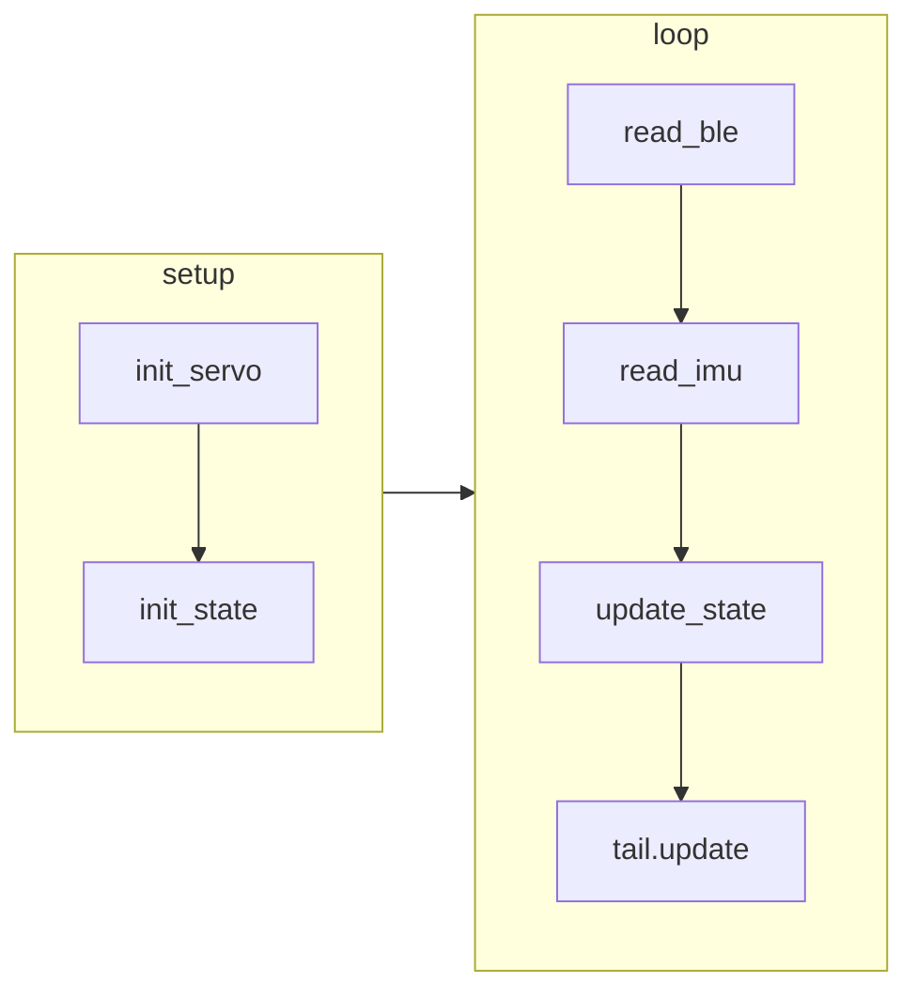

# Tail controller

Arduino codes for Tail controller in [Hacka-Tail](https://protopedia.net/prototype/3929)

## Control Flow

action:

- swing tail up/down/left/right

## Hardware

- Micro-controller: [M5Stack Atom Lite](https://docs.m5stack.com/en/core/ATOM%20Lite)
- Servo motors: FeeTech STS3215
- IMU : MPU6050
- Microphone: Rasbee MAX4466

## Pin Assignment

- 26 -- RX for Servo I/F
- 32 -- TX for Servo I/F
- 21 -- Software I2C SCL for IMU
- 25 -- Software I2C SDA for IMU
- 33 -- Microphone

## Robot Functions

- Tail swing reacted stroking (reacted to acc change)
- Whim swing (swing with random interval)
- Streaming data with BLE
- Accepts command with BLE

## Future Function

- large tail swing (hardware issue)
- singing
- react to sound

## Notes

- mic library: <https://github.com/Seeed-Studio/Seeed_Arduino_Mic>
- <https://github.com/botamochi6277/Tail-Robot/tree/main>
